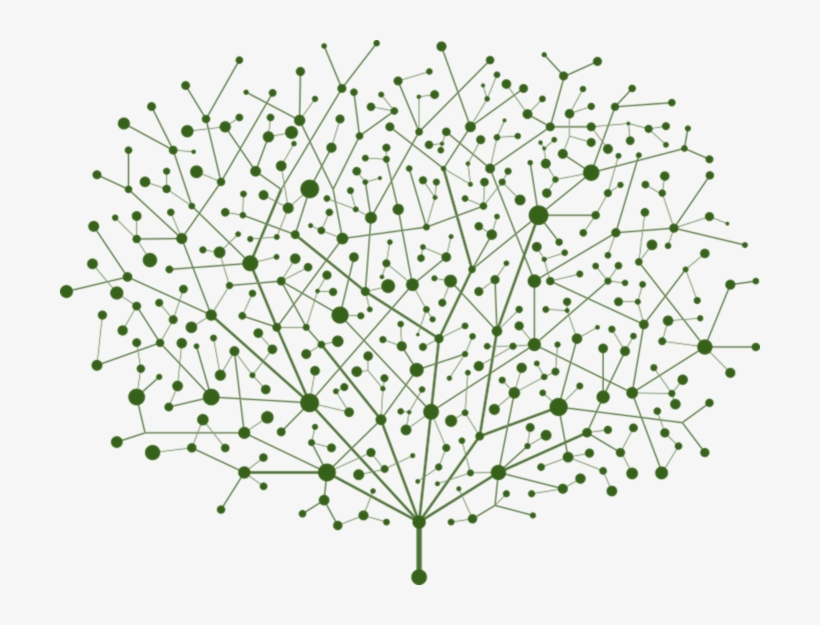
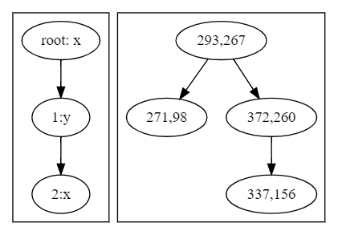
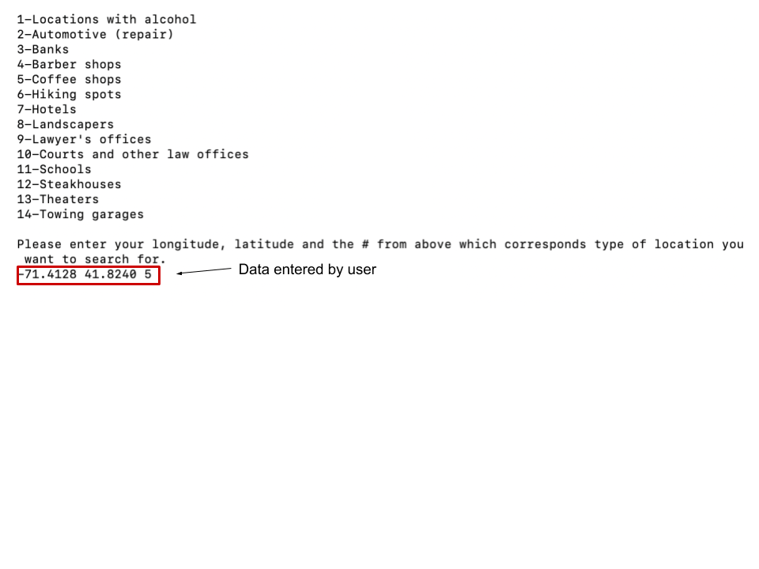
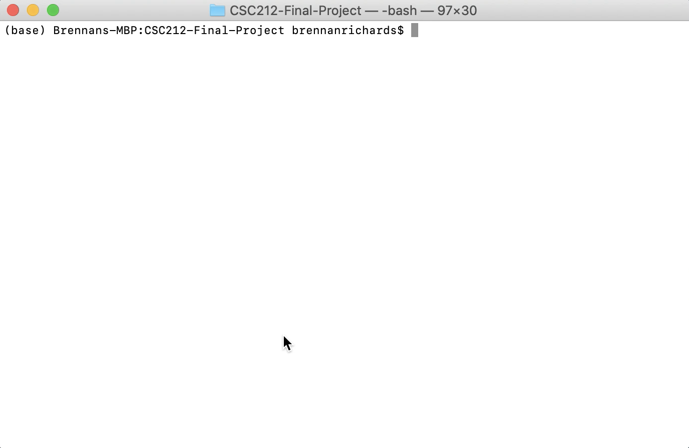

# CSC 212 Final Project - KD Trees
~~~
- Students
    - Raymond Turrisi
    - Brennan Richards
    - Alfred Timperley
~~~
#### *All References [] are with respect to the paper.

## Overview
### Table of Contents
Welcome to the GitHub for our CSC 212 Final Project. Here we will provide a brief description of KD Trees, the fundamental algorithms, theoretical run times, as well as some example implementations, with more information on this project in the submitted paper. The outline for this README.md is as follows.

~~~
1. Overview
2. Design Objective
    1. Modularity (Fully Templated)
    2. Dependencies
3. Methods Included In <KDTree> Class
    1. Constructors
    2. Methods: (return type) Function
    3. Destructors
4. Using the application
    1. Compiling
    2. Running
    3. Demonstration
~~~

### Introduction to KD Trees
The K-D tree is a multidimensional BST which was first created in 1975
by Dr. Jon Louis Bentley, a current professor at Carnegie Mellon
University’s Computer Science and Mathematics Department [1]. Per Dr.
Bentley’s thesis, the K-D Tree was developed during an investigation of
a multidimensional divide-and-conquer technique which decomposes a
problem with *n* points within *K* dimensions [2]. A key feature of this
data structure is that it allows the efficient tree traversal for an
algorithm which finds the nearest neighbor between two nodes or a
comparable location in <em>Θ(n Log2 n)</em>.

K-D trees are simple in nature, and are highly efficient for processing
multi-dimensional keys. While they are very similar to a Binary Search
Tree, there are several distinguishing features in their construction,
insertion, and traversal. First, K-D trees make branching decisions
based on a condition and the level of the node with respect to the root
node, and this is done by tracking its depth, *d*, in a tree, and a
*discriminator*, *i* [3]. Recursive functions identify the *type* of level
they are on with this discriminator, where:

*i* = *d*%*K*,  *i* ∈ \[0, *K*\)

For example, take two dimensional data represented by traditional *x*
and *y*, with discriminators 0 and 1 respectively, across three levels
with data:

{(293, 267), (271, 98), (372, 260), (337, 156)}

The steps for insertion would proceed as follows:
~~~
-   Insert node (293,267) on depth d = 0 with iterator i = 0 as
    root.

-   Insert node (271,98) by checking the dimension belonging to the
    current iterator, such as on i = 0, compare K = x, where this
    node will go to the left of the tested node.

-   Insert node (372,260) by checking the dimension belonging to the
    current iterator, such as on i = 1, compare K = y, where this
    node will go to the right of the tested node (271,98).

-   Insert (337,156) by checking the dimension belonging to the current
    iterator, such as on i = 0, compare K = x, where this node
    will go to the right of the tested node (271,98) being unto testing
    against node (372,260). Now, i = 1 which belongs to the second
    dimension y, where 156 < 260, where now node (337,156) will be
    the left child of (372,260).
~~~

With this, a 2-D tree with four nodes has been created as seen in the figure below.

## Design Objective
The an additional goal of this groups work was to develop highly modular code, making the class entirely templated with as minimal dependencies as possible in order to get the fundamental benefits if tied to another class for another application. With this class being templated, it only assumes that dimentional data, such as cartesian coordinates, are stored in a standard template vector of doubles, which in its current version the class accesses as "coords", but this can be easily adopted.
One realization at the onset of the project, is that there were not many implementations of K-D Trees available online which we would compare our implementations to, where putting in the additional effort into the project and creating a base version which could be found and used by others would be ideal. The other thought was that the group may continue to develop the code into becoming more functional and efficient in the near future.

## Methods
This code comes ready with the following features: inserts, searches, nearest neighbors searches, and a constructor which takes a vector of pointers and builds a balanced K-D tree of K dimensions. In addition to these fundamental methods, there are several more which is unique to our teams application. 
~~~
Template <t>
1. Constructors
    1. KDTree<t>(unsigned int _dimensions)
        - Builds a tree with the number of specified dimensions. 
    2. KDTree<t>(t data)
        - Builds a tree with one instance of data (as root). 
    3. KDTree<t>(std::vector<t*> vector_of_structs, unsigned int _dimensions)
        - Creates a balanced KD tree with a Median of Medians algorithm. 
2. Methods
    1. void insert(t data)
        - Inserts a new node into the tree. 
    2. bool search_for_element(t data)
        - Returns of an element exists in a tree. 
    3. t nearest_neighbor(t data)
        - Finds the nearest neighbor in a tree of a passed class and returns a copy of the nearest class, with an average time of O(logN).
    4. t nearest_neighbor(t data, double &best_distance)
        - Finds the nearest neighbor in a tree of a passed class and returns a copy of the nearest class, and the distance between them, with an average time of O(logN).
    5. t nearest_neighbor(std::vector<double> local_coords)
        - Finds the nearest neighbor in a tree of passed coordinates and returns a copy of the nearest class, with an average time of O(logN).
    6. t nearest_neighbor(std::vector<double> local_coords, double &best_distance)
        - Finds the nearest neighbor in a tree of passed coorindates and returns a copy of the nearest class, and the distance between them, with an average time of O(logN).
    7. t nearest_neighbor_best(t data)
        - Same as above, but in O(n) time and returns the guaranteed closest neighbor. 
    8. t nearest_neighbor_best(t data, double &best_distance)
    9. t nearest_neighbor_best(std::vector<double> local_coords)
    10. t nearest_neighbor_best(std::vector<double> local_coords, double &best_distance)
    12. void postOrder()
        - Prints post order notation.
    13. void inOrder()
        - Prints in order notation.
    14. void preOrder()
        - Prints pre order notation. 
    15. void dotOut(std::string fname_out)
        - Returns a recent_graph.dot file into the working directory, in addition to generating an .svg named the passed file name. 
3. Destructors
    1. void destroy()
        - Resets tree as if it was called with constructor 1.1.
~~~
In the future, a further study of K-D Trees will take place. Here, we would like to add ranging finding algorithms, nearest query algorithms, and other utilities which may prove useful in an implementation of a class of this style. 

### Dependencies
~~~
1. Graphviz installation
    - In order to run the dotOut function, you must have graphviz installed locally, or you can comment out cmd2 in KDTree.hpp to still return the recent_graph.dot file. 
    - To install, run   << sudo apt-get install graphviz >>.
~~~
## Using the application

Our application code lives in the 'command_line_application.cpp' file.

### Compiling
Compile the code with the following command: g++ command_line_application.cpp -std=c++11 -o main.

### Running
Start the application with './main'. After running, you will be prompted to enter a longitude, latitude and a choice for a location type from a list like so:

### Demonstration
Click below to watch a demonstration video for running our command line application.

