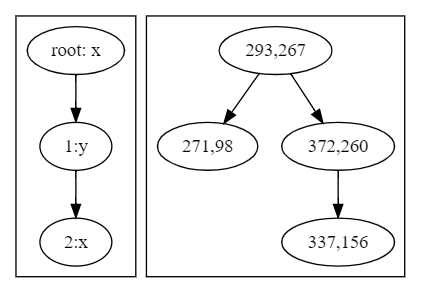

# CSC 212 Final Project - KD Trees
~~~
- Students
    - Raymond Turrisi
    - Brennan Richards
    - Alfred Timperley
~~~
#### *All References [] are with respect to the paper.

## Overview
### Table of Contents
Welcome to the GitHub for our CSC 212 Final Project. Here we will provide a brief description of KD Trees, the fundamental algorithms, theoretical run times, as well as some example implementations, with more information on this project in the submitted paper. The outline for this README.md is as follows.

~~~
1. Overview
    1. Table of Contents
    2. Intro
    3. Theory
2. Design Objective
    1. Modularity (Fully Templated)
    2. Dependencies
3. Methods Included In <KDTree> Class
    1. Constructors
2. Methods: (return type) Function
    1. (void) Insert
    2. (void) Remove Node
    3. (bool) Search
    4. (<Template Class>) Nearest Neighbor
    5. (void) Destroy Tree
    6. (void) Print Post Order
    7. (void) Print In Order
    8. (void) Print Pre Order
    9. (void) Print Graph.dot & Graph.svg (writes to files)
4. Example Implementations
    1. App 1
    2. App 2
3. App 3
~~~

### Introduction to KD Trees
The K-D tree is a multidimensional BST which was first created in 1975
by Dr. Jon Louis Bentley, a current professor at Carnegie Mellon
University’s Computer Science and Mathematics Department [1]. Per Dr.
Bentley’s thesis, the K-D Tree was developed during an investigation of
a multidimensional divide-and-conquer technique which decomposes a
problem with *n* points within *K* dimensions [2]. A key feature of this
data structure is that it allows the efficient tree traversal for an
algorithm which finds the nearest neighbor between two nodes or a
comparable location in <em>Θ(n Log2 n)</em>.

K-D trees are simple in nature, and are highly efficient for processing
multi-dimensional keys. While they are very similar to a Binary Search
Tree, there are several distinguishing features in their construction,
insertion, and traversal. First, K-D trees make branching decisions
based on a condition and the level of the node with respect to the root
node, and this is done by tracking its depth, *d*, in a tree, and a
*discriminator*, *i* [3]. Recursive functions identify the *type* of level
they are on with this discriminator, where:

*i* = *d*%*K*,  *i* ∈ \[0, *K*\)

For example, take two dimensional data represented by traditional *x*
and *y*, with discriminators 0 and 1 respectively, across three levels
with data:

{(293, 267), (271, 98), (372, 260), (337, 156)}

The steps for insertion would proceed as follows:
~~~
-   Insert node (293,267) on depth d = 0 with iterator i = 0 as
    root.

-   Insert node (271,98) by checking the dimension belonging to the
    current iterator, such as on i = 0, compare K = x, where this
    node will go to the left of the tested node.

-   Insert node (372,260) by checking the dimension belonging to the
    current iterator, such as on i = 1, compare K = y, where this
    node will go to the right of the tested node (271,98).

-   Insert (337,156) by checking the dimension belonging to the current
    iterator, such as on i = 0, compare K = x, where this node
    will go to the right of the tested node (271,98) being unto testing
    against node (372,260). Now, i = 1 which belongs to the second
    dimension y, where 156 < 260, where now node (337,156) will be
    the left child of (372,260).
~~~

With this, a 2-D tree with four nodes has been created as seen in the figure below.

### Theory

## Design Objective

## Methods

~~~
1. Constructors

2. Methods

3. Destructors
~~~

## Example Implementation

### Dependencies
~~~
1. Graphviz installation

2. Two
~~~
### App 1

### App 2

### App 3
